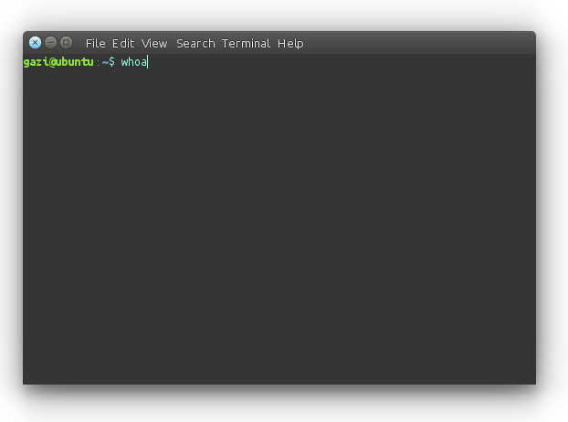

Ubuntu ile Linux'e Giriş
========================

Normalde, "*Linux'de Temel İşlemler*" ya da "*Linux'de temel İşlemler ve Komutları*" başlık için daha uygun olabilirdi. Ama Linux'de, komutlar her şeyin başıdır.

Eğer bu sizin Linux'e ilk bakışınız ise, ilk önce fare ve klavyenizle alışık olunan şekilde işletim sistemini denemenizi öneriyoruz. Sol tafataki başlatıcı çubuktan Dosya Yöneticisi'ni açabilirsiniz. Ev dizininiz açılacaktır. Basitçe fareyle sağ tık yaparak yeni klasör veya dosya oluşturabilirsiniz. Firefox ile dilediğiniz Wikipedi sayfalarını gezebilir, rhythmbox ile müzik dinleyebilirsiniz.

Linux'de Temel Komutlar ve İşlemler
-----------------------------------
	
Şimdi sırada, Linux'u kendi yolundan kullanmak var. Eğer Ubuntu'yu düzgünce yüklemişseniz, Terminal penceresini sol taraftaki başlatıcıdan kısayoluna tıklayarak, başlangıç menüsüne `terminal` yazarak , ya da ``Ctrl + Alt + T`` klavye kısayoluyla açabilirisiniz.

Terminal penceresi şuradaki gibi belirecektir:

İlk önce basit komutlarla başlayalım. Açık olan terminale, ``whoami`` yazıp enter'layın. Bu komut, ekrana kullanıcı adınızı yazar: 

.. warning::

	Eğer komutları buradan kopyalayıp kendi terminaline yapıştırmayı tercih ediyorsanız, Lütfen komutun başındaki dolar işaretini kopyalamayın. O sadece kutucuğun içindeki şeyin komut olduğunu belirtmek içinidir. Şayet bakmışsanız, terminalinizde zaten olduğunu fark etmişsinizdir.
	
::
	
	$ whoami
	
Sonra da ``ls`` yazın. Bu komut klasörün(dizinin) içeriğini listeler. Ayrıca ``pwd`` komutuyla da hangi klasörde bulunduğunuzu öğrenebilirsiniz.

::
	
	$ ls 

::
	
	$ pwd 

Bu dizinde canınız sıkılırsa, diğer dizinlerde de gezinebilirsiniz. Klasör değiştirme komutu ``cd``'dir. Bu komut, bir parametre de alabilir:

::
	
	$ cd /usr/bin

İkinci parametre, gitmek istediğiniz klasörün yoludur. Yukarıdaki komut sizi Kök dizinin (``/``) altındaki ``usr`` dizininin altındaki ``bin`` klasörüne götürür. Terminalde yazı yazdığınız yerin hemen yanında, kullanıcı adınızı, bilgisayarınızın hostname'ini, o an içinde bulunduğunuz klasörün yolunu, ve o anki kullanıcının tipini; normal kullanıcı için dolar işareti (``$``), yetkili kullanıcı için kare işareti (``#``) olmak üzere görebilirsiniz.

Çoğu program ev dizininizin yolunu ``~`` (tilda) karakterinden tanıyabilir. Parametre almamış ``cd`` komutu da sizi o anki kullanıcının ev dizinine götürür:

::
	
	$ cd

Sırada bir şeyler oluşturmak var. ``my_first.txt`` adında bir dosya oluşturmak için, terminalinizde ``touch`` komutunu kullanın. eğer ev dizinindeyseniz, başarılı bir şekilde oluşturacaktır:

::
	
	$ touch ilk_dosyam.txt

Şimdi, oluşturduğumuz dosyayı görelim. Basitçe ``ls`` komutunu girip enter'layın:

::
	
	$ ls

Bu komut, o dizindeki dosya ve klasörleri listeler. Oluşturduğumuz dosyayı yüklü gelen editör ``gedit`` ile düzenlemek için şunu girin:

::
	
	$ gedit ilk_dosyam.txt

İçine bir şeyler yazın, yukarıdaki menü'den dosyayı kaydedin veya ``Ctrl + S`` kısayolunu kullanın. Sonra ``gedit``'ten çıkın. ``gedit``'i açtığınız terminal ekranı, kapattıktan sonra açmadan önceki hali gibi kullanılabilir olacaktır.

Şimdi bu dosyanın içinde ne yazdığını konsoldan (terminal) görmek istersek ``cat`` komutunu kullanabiliriz:

::
	
	$ cat ilk_dosyam.txt

Terminal ekranından başka pencereye geçiş yapmak zorunda olmamak için, ``gedit`` yerine ``nano``'yu kullanabilirsiniz.

Konsoldan yeni klasör oluşturmak için, ``mkdir`` komutunu kullanabilirsiniz. Eğer bu komutla girdiğiniz parametre, ``/`` karakteriyle başlarsa, oluşturmak istediğiniz klasöre tam adres girmelisiniz. Eğer değilse, basit isimler kullanabilirsiniz:

::
	
	$ mkdir ilk_dizinim_123

Bu komut, o anki bulunduğunuz dizinde ``ilk_dizinim_123`` adlı yeni bir klasör oluşturacaktır. İsterseniz ``ls`` komutuyla oluşmuş mu diye bakabilirsiniz.

Sonraki komutumuz ``cp``. Bu komut, ``<kaynak adresi>``'nden ``<hedef adresi>`` ne kopyalama yapar. Eğer ev dizinindeyseniz, direk yazabilirsiniz, değilseniz önce yukarıda belirtildiği gibi ev dizinine gidebilirsiniz:

::
	
	$ cp ilk_dosyam.txt ilk_dizinim_123/ilk_dosyam.txt

Bu komut, oluşturduğunuz ``.txt`` dosyasını oluşturduğunuz klasörün içine kopyalar. Ayrıca bu işlemi yapmak için ev dizininde olmak zorunda değildiniz, Eğer kullanıcı adınız ``frodo`` ise, (değilse ``frodo``'yu kendi kullanıcı adınızla değiştirin) istediğiniz yerden:

::
	
	$ cp /home/frodo/my_first.txt /home/frodo/my_folder_123/my_first.txt

diyebilirsiniz. Terminal ekranınızın okunabilirliğini artırmak için, onu renklendirebilirsiniz. Bunun için, ``.bashrc`` dosyanızı açıp ``#force_color_prompt=yes`` satırının başındaki ``#`` karakterini silin ve dosyayı kaydedip çıkın. Bu işlemi yaptıktan sonra terminali kapatıp açtığınızda değişikliği görebilirsiniz. Tüm bunlar için, ``.bashrc`` dosyasını açarak başlayabilirsiniz:

::
	
	$ gedit ~/.bashrc

Sonraki komutumuz biraz tehlikelidir, çünkü bize bilgisayarda tüm yetkileri verir. Not: ``sudo`` komutu sizden kullanıcınızın şifresini isteyecektir, ama şifre, girerken klasik yıldızlar (``****``) veya noktalar (``••••``) şeklinde görünmez, siz yazıp enter'layın;

::
	
	$ sudo whoami

Şimdi, Bu programı root kullanıcısının yetkileriyle çalıştırdık. Bu yüzden bizim kullanıcı adımız yerine ``root`` yazdı.

Buradaki ``&&`` karakterleri ise aynı anda birden çok komutu tek enter'la girmemizi sağlar:

::
	
	$ whoami && sudo whoami

Kayıtlı depolardan bir program yüklemek çok basit bir işlemdir. Şu ön ek ile: ``sudo apt-get install`` bir sürü program yükleyebilirsiniz. Kaldırmak için de aynısının: ``sudo apt-get remove`` versiyonunu kullanabilirsiniz. Eğer ROS'u yüklemişseniz, MRP2'nin gazebo simülasyon paketlerini aşağıdaki komutla yükleyebilirsiniz:

::
	
	$ sudo apt-get install ros-indigo-mrp2-gazebo

Ama, ROS'un doğru bir şekilde yüklendiğine emin olun. Zaten büyük ihtimalle henüz yüklemediziniz, Sonraki tutorial'larda nasıl yüklendiği gösterilecektir.

Bu kılavuzdaki son kmoutumuz ``man``. ``man`` komutunu diğer komutlar hakkında bilgi edinmek için kullanabilirisiniz. Örnek olarak:

::
	
	$ man touch

ya da

::
	
	$ man rm

diyebilirisiniz. Daha fazla bilgi edinmek için: `Ubuntu'da terminal kullanımı <https://help.ubuntu.com/community/UsingTheTerminal>`_ (ingilizce) sayfasını ziyaret edbilirsiniz.

