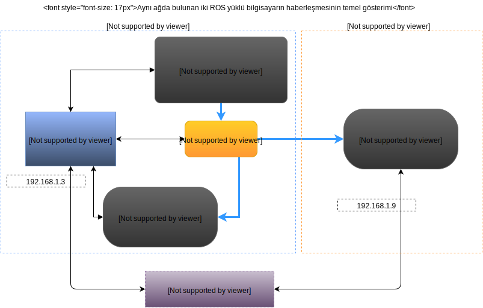

Robot İşletim Sistemi'ne (ROS) Giriş
====================================

ROS(Robot Operating System ya da Robotik İşletim Sistemi), robot yazılımı geliştirmek ve heterojen bir bilgisayar kümesini işlevselleştirmek gibi işler için derlenilmiş kütüphane ve araçlar barındıran yazılım iskeletlerinden oluşur. Ek olarak, donanım soyutlaması, aygıt sürücüleri, kütüphaneler, görselleştiriciler, mesaj iletimi ve paket yönetimi vs. sunar.

ROS tabanlı çalışan işlemler grafikte gösterilebilir şekilde tasarlanmıştır. Bu mimari grafiklerle düğümlerin çoklu sensör, kontrol mekanizmaları, konum, tetikleyici ve diğer işlemlerin mesajları gösterilir. For more basic information, visit: `ROS Wikipedia <https://en.wikipedia.org/wiki/Robot_Operating_System>`_(İngilizce).

ROS, şuan için yanlızca UNIX tabanlı işletim sistemlerinde çalışmaktadır. ROS için yazılan yazılımlar öncelikle Ubuntu ve Mac OS X'de test edilmektedir. Yine de   contributing support Fedora, Gentoo, Arch Linux ve diğre Linux platformları da ROS Topluluğunca desteklenmektedir.

Linux, zaten kullanışlı uygulamalarım, kütüphanelerin, haberleşme sürücülerinin vs. gücüne sahiptir. ROS yüklemesi, hazır bir işletim sistemi üzerine gelmektedir. Linux, arkaplan işlerini hallederek Robot yazılımı üretmeyi kolaylaştırmaktadır.

Ana Mimariye Genel bir Bakış
----------------------------
	
`Node'lar(Düğümler) <http://wiki.ros.org/Nodes>`_: Node, bir ROS paketindeki çalıştırılabilir bir dosyadan fazlası değildir. ROS node'ları, diğer node'larla haberleşebilmek için ROS istemci kütüphanesini kullanır. Node'lar, bir topic'e abone olabilir ya da o topic'de paylaşım yapabilir. Node'lar ayrıca bir Servis sağlayabilir veya bir servisi de kullanabilir.

`Mesajlar <http://wiki.ros.org/Messages>`_: Node'lar, birbirleriyle topic'lere mesaj atarak haberleşir. Bir mesaj, farklı tiplerde mesajlar içeren basit bir veri yapısıdır. Standard ilkel tipleri (int, float, bool, vb.) bir dizi şeklinde içerecek şekilde destekler. Messages C struct'ları gibi rastgele yapılar ve diziler içerebilir.

`Topic'ler(ing. Konu) <http://wiki.ros.org/Topics>`_: Topic'ler, bir adı olan ve node'ların üzerinden mesaj alıp verdiği veri yollarıdır. Topic'ler, aldıkları mesajı kendi okudukları şekliyle ayrıştıran anonim bir mesajlaşma yapısına sahiptir. Genel yaklaşımda, node'lar, kiminle haberleştiklerinden habersizdir. Bunun yerine, Bunun yerine, abone oldukları topic'ten dinledikleri ve yayın yaptıkları topic'lere basılan verilerle ilgilenirler. Bir topic üzerinde birden fazla yayıncı veya abone bulunabilir.

`ROS Master <http://wiki.ros.org/Master>`_: ROS Sisteminde, Node'lara isim sağlayıcılığı ve kayıt servisi sağlayan işlemdir. Servisleri izlediği gibi Topic'lerin yayımcı ve abonelerini de izler. Her bir ROS Node'unun bir diğerini bulmasını sağlar. Bir defa node'lar birbirlerini konumlandırdıktan sonra TCP benzeri protokollerle uçtan-uca haberleşebilirler.

`rosout <http://wiki.ros.org/rosout>`_: Sistem genelinde ``/rosout`` topic'ine gönderilen mesajların kayıt mekanizmasıdır. ``stdout`` ya da ``stderr`` 'in ROS alternatifidir.

`roscore <http://wiki.ros.org/roscore>`_: ROS tabanlı bir sistemin ön gereksinimleri olan node ve programların: "**ROS Master + rosout + Parametre Sunucusu**" bileşimidir.

Yerel Ağda Örnek bir Uygulama
-----------------------------

.. figure:: _static/ros_ag_yerel.svg
   :align: center

Bu örnekte, Yayımcı node, bir takım mesajlar oluşturup``chatter`` topic'ine gönderiyor. Diğer iki abone node da, ``chatter`` topic'ini dinlemekte. Bu örneğin kodlarını ilerleyen adımlarda göstereceğiz.
 
İki ROS yüklü bilgisayarın Haberleşmesi
---------------------------------------

Bu örnekte ise, Evimizde gezinen ve evimizin wifi'ına bağlanmış bir robot bulunmakta. Diğer tarafta ise, kişisel bilgisayarımız da aynı ağa bağlı. Not: Eğer deneysel bir işle uğraşmıyorsak ve robotun bilgisayarında bir adet ``ros_master`` çalışıyorsa, ikinci bir tane açmaya gerek yoktur. Yeni çalışacak node'ların ``ros_master``'ın çalıştığı adresi bilmeleri yeterlidir.

Buradaki ``laser_sensor_node`` adlı node, bir donanım haberleşme programıdır(driver denebilir). Sensörden okuduğu ham veriyi ros node'larının anlayabileceği şekle sokarak ``laser_scan`` topic'ine basar. 

``gmapping`` node'u da, bu ``laser_scan`` topic'ine abone olarak diğer topic'lerden okuduğu verilerle de birleştirerek harita çıkarır. 

Son olarak RViz node'u, robot üzerinde değil, kişisel bilgisayarımız üzerinde çalışmaktadır. İlk başta, ``laser_scan`` topic'ini önceden adresini bildiği ``ros_master`` ile konumlandırır. Sonra, RViz'imiz ``laser_scan`` topic'inden lazer verisini ağ yoluyla okumaya başlar.

Ayrıca bu örnek için, RViz de başka topic'ler de dinlemektedir. Harita ile ilgili topic de bunlara dahildir. Harita ve lazer verisini okuyarak, aşağıdan görülebileceği gibi robotun gözünden engelleri ve boş alanları görebilmemiz için bize lazer verisini kırmızı nokta ve çizgiler şeklinde gösterir:

.. figure:: _static/gmapping.png
   :align: center

