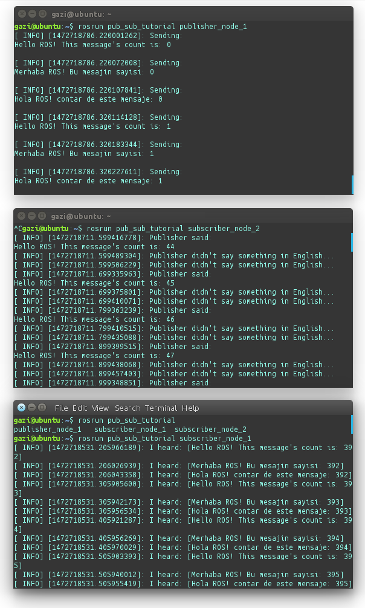

5. Basit bir Haberleşme Örneği
==============================

Bu kılavuzda, Sürekli birşeyler yazan bir yayımcı yazacağız. ve iki tane de abone node; Bir tanesi aldığı tüm mesajları ekrana yazacak, diğeri ise sadece İngilizce olanları yazacak.

hedefimiz aşağıdaki grafikteki node'ları yazmak:

1. Paketi Oluşturun
-------------------

Eğer paketi oluşturmakta sorun yaşarsanız `github sayfası <https://github.com/milvusrobotics/ros_tutorials/tree/master/pub_sub_tutorial>`_ndan daha önceden mrp2 paketlerini çektiğimiz gibi workspace'inize çekebilirsiniz ama iyi bir başlangıç deneyimi için elle oluşturmanızı öneriririz.

Önceki kılavuzlarda, workspace'imizi oluşturmuştuk. İlk önce, yazacağımız node'lar, bir pakette olmak zorundadır. Yeni bir paket oluşturmak için workspace'inizin ``src`` klasörüne gidin:

::
	
	$ cd ~/catkin_ws/src/

Ve paketinizi aşağıdaki komutla oluşturun. ``catkin_create_pkg`` komutuna verdiğiniz parametrelerle otomatik olarak paketinizin gereksinimleri ayarlanır:

::
	
	$ catkin_create_pkg pub_sub_tutorial std_msgs rospy roscpp

``pub_sub_tutorial`` paketimizin adıdır ("Publisher Subscriber Tutorial" yani *Yayımcı ve Abone Örneği*). Diğerleri de gereksinimlerimiz.

2. Dosyaları Oluşturun
----------------------

Şimdi, projenin kendi ``src`` klasörüne giderek dosyalarımızı oluşturalım:

::
	
	$ cd ~/catkin_ws/src/pub_sub_tutorial/src/

::
	
	$ touch pub1.cpp && touch sub1.cpp && touch sub2.cpp

**2.1. Yayımcı Node'u Oluşturma**

Bu kılavuzda, sadece bir yayımcımız var. Aşağıdaki kodları ``~/catkin_ws/src/pub_sub_tutorial/src`` kalsöründeki ``pub1.cpp`` dosyasının içine yapıştırın:

.. code-block:: c
	
	#include "ros/ros.h"
	#include "std_msgs/String.h"
	
	#include <sstream>
	
	int main ( int argc, char **argv )
	{
		ros::init ( argc, argv, "publisher_node_1" );
		ros::NodeHandle n;
		ros::Publisher chatter_pub = n.advertise<std_msgs::String> ( "chatter", 1000 );
		ros::Rate loop_rate ( 10 );
		
		int count = 0;
		
		std_msgs::String msg;
		std::stringstream ss;
		
		while ( ros::ok() )
		{	
			ss.str(std::string());
			ss << "Hello ROS! This message's count is: " << count;
			msg.data = ss.str();
			ROS_INFO ( "Sending:\n%s\n", msg.data.c_str() );
			chatter_pub.publish ( msg );
			
			ss.str(std::string());
			ss << "Merhaba ROS! Bu mesajin sayisi: " << count;
			msg.data = ss.str();
			ROS_INFO ( "Sending:\n%s\n", msg.data.c_str() );
			chatter_pub.publish ( msg );
			
			ss.str(std::string());
			ss << "Hola ROS! contar de este mensaje: " << count;
			msg.data = ss.str();
			ROS_INFO ( "Sending:\n%s\n", msg.data.c_str() );
			chatter_pub.publish ( msg );
			
			ros::spinOnce();
			loop_rate.sleep();
			count++;
		}
		
	return 0;
	}

**Açıklama**

Bir ROS sisteminin herhangi bir parçasını kullanmak için  ``ros::init()`` çağrısını yapmalısınz:

.. code-block:: c
	
	ros::init ( argc, argv, "publisher_node_1" );

``ros::init()`` fonksiyonunun, ``argc`` ve ``argv``'yi görerek komut ekranından gelen isimlendirme ve parametrelendirme verilerini işleyebilmesi gerekir. Kodun içinde direk olarak remap etmek için ``init()``'in farklı versiyonları kullanılabilir fakat çoğu komutla çalıştırılan program için ``argc`` ve ``argv`` yi geçirmek en iyi yöntemdir. ``init()``'in yukarıda gördüğünüz 3. parametresi ise node'umuzun işleminin adıdır.

.. code-block:: c
	
	ros::NodeHandle n;

NodeHandle ise, ROS Sistemi ile haberleşme için ana erişim noktasıdır. İlk NodeHandle node'un tamamen hazır olması için yapılandırmaya, son NodeHandle ise node'u kapatmak için yok edilmeye hazırlar.

.. code-block:: c
	
	ros::Publisher chatter_pub = n.advertise<std_msgs::String> ( "chatter", 1000 );
	...
	chatter_pub.publish ( msg );

Buradaki nesnenin ``publish()`` fonksiyonu mesaj göndermeye yarar. Aldığı parametre, bir mesaj nesnesidir. Bu nesnenin tipi, ``advertise<>()`` çağrısındaki topic'in mesaj tipiyle uyum sağlamak zorundadır.

**2.2. Abone Node'ların Yazımı**

Aşağıdaki kodları ``sub1.cpp`` dosyasına yapıştırın:

.. code-block:: c
	
	#include "ros/ros.h"
	#include "std_msgs/String.h"

	void chatterCallback ( const std_msgs::String::ConstPtr &msg )
	{
		ROS_INFO ( "I heard: [%s]", msg->data.c_str() );
	}

	int main ( int argc, char **argv )
	{
		ros::init ( argc, argv, "subscriber_node_1" );
		ros::NodeHandle n;
		ros::Subscriber sub = n.subscribe ( "chatter", 1000, chatterCallback );
		ros::spin();
		
	return 0;
	}

**Açıklama**

.. code-block:: c
	
	ros::Subscriber sub = n.subscribe ( "chatter", 1000, chatterCallback );

.. code-block:: c
	
	void chatterCallback ( const std_msgs::String::ConstPtr &msg )
	{
		ROS_INFO ( "I heard: [%s]", msg->data.c_str() );
	}	

Yukarıda geçen ``subscribe()`` çağrısı, belirttiğimiz topic'e gelen mesajları nasıl almak istediğimizi ROS'a belirtmemizi sağlar. Bu çağrı, ROS Master node'una, kimin abone veya yayımcı olduğuyla ilgili kayıt olmamızı sağlar.  Topic'e gelen tüm mesajlar 'callback' fonksiyonuna düşer, burada fonksiyonun adına ``chatterCallback`` denilmiş. ``subscribe()`` çağrısı, bize daha sonra istediğimizde abonelicten çıkabilmek (*unsubscribe*) için bir ``Subscriber`` nesnesi döndürür. Diğer türlü unsubscribe olmazsak, zaten Subscriber'ımızın tanımlandığı çengelli parantezlerin dışına çıktığımızda otomatik olarak unsubscribe oluruz.

``subscribe()`` Fonksiyonunun ikinci parametresi ise mesaj kuyruğunun büyüklüğü. Eğer mesajlar, node'un işleyebildiğinden hızlı geliyorsa, önce sırasıyla en eskilerden başlayarak bu sınıra göre artan mesajlar silinir.

``ros::spin()`` callback'lerin tetiklenmesini sağlayacak döngüye girmemizi sağlar. bu versiyonunda, tüm callback'ler bu ana thread içinde çağrılır. ``ros::spin()`` döngüsü, ``Ctrl-C``'ye basılınca veya node, Master tarafından kapatılınca sonlanır.

Son olarak aşağıdaki kodları ``sub2.cpp`` dosyasına yapıştırın:

.. code-block:: c
	
	#include "ros/ros.h"
	#include "std_msgs/String.h"

	void chatterCallback ( const std_msgs::String::ConstPtr &msg )
	{
		if (msg->data.substr(0, 5) == "Hello")
		{
			ROS_INFO ( "Publisher said:\n%s", msg->data.c_str() );
		}
		else 
		{
			ROS_INFO ( "Publisher didn't say something in English...");
		}
	}

	int main ( int argc, char **argv )
	{
		ros::init ( argc, argv, "subscriber_node_2" );
		ros::NodeHandle n;
		ros::Subscriber sub = n.subscribe ( "chatter", 1000, chatterCallback );
		ros::spin();
		
	return 0;
	}

Burada ek olarak, gelen mesajın ilk 5 karakterine bakıyoruz. Eğer ``Hello``'ya eşitse, Subscriber mesajın İngilizce olan olduğunu anlıyor:

.. code-block:: c
	
	if (msg->data.substr(0, 5) == "Hello")

3. Node'ları Derleyin
---------------------

Projenizin içinde otomatik olarak oluşturulan ``CMakeLists.txt`` dosyası bulunmaktadır. Onu istediğiniz metin editörüyle açın. ``#`` ile başlayan yorum satırlarına aldırmayın, onlar sadece örnek olması içindir. Aşağıdaki satırları en alta ekleyin:

.. code-block:: guess
	
	include_directories(include ${catkin_INCLUDE_DIRS})

	add_executable(publisher_node_1 src/pub1.cpp)
	target_link_libraries(publisher_node_1 ${catkin_LIBRARIES})
	add_dependencies(publisher_node_1 pub_sub_tutorial_generate_messages_cpp)

	add_executable(subscriber_node_1 src/sub1.cpp)
	target_link_libraries(subscriber_node_1 ${catkin_LIBRARIES})
	add_dependencies(subscriber_node_1 pub_sub_tutorial_generate_messages_cpp)

	add_executable(subscriber_node_2 src/sub2.cpp)
	target_link_libraries(subscriber_node_2 ${catkin_LIBRARIES})
	add_dependencies(subscriber_node_2 pub_sub_tutorial_generate_messages_cpp)

	
``CMakeLists.txt`` dosyası hakkında daha fazla bilgi için şurayı ziyaret edebilirisin: `ROS Wiki - CMakeLists.txt <http://wiki.ros.org/catkin/CMakeLists.txt>`_.

Workspace'inizin en üst klasörüne gelip hepsini derleyin:

::
	
	$ cd ~/catkin_ws

::
	
	$ catkin_make

Ve açık olan ve bu yeni node'ları çalıştıracağınız terminallerinizde yeni derlemenizi ``source`` etmeyi unutmayınız:

::
	
	$ source devel/setup.bash

``catkin_make`` ile derledikten sonra eğer ``.bashrc`` dosyasına source komutunu zaten eklemişseniz, Yeni bir terminal ekranı açmak bu ``source`` işlemini otomatik olarak yapacaktır.

4. Node'ları Test Edelim
------------------------

Önceki kılavuzlarda, ``roscore``, ``mrp2_gazebo.launch`` doyasını çalıştırırken otomatik olarak açılmıştı. Ama şimdi, elle açmak zorundayız:

::
	
	$ roscore

Bu komutu girdiğiniz terminal penceresini küçültebilirsiniz, sonrasında da yayımcı node'umuzu çağıralım:

::
	
	$ rosrun pub_sub_tutorial publisher_node_1

sonra da başka bir terminal açıp birinci abonemizi başlatalım:

::
	
	$ rosrun pub_sub_tutorial subscriber_node_1

Sonra da bir başka terminalde ötekini:

::
	
	$ rosrun pub_sub_tutorial subscriber_node_2

Çıkan sonuçlar, şuradakine benzer olacaktır:

