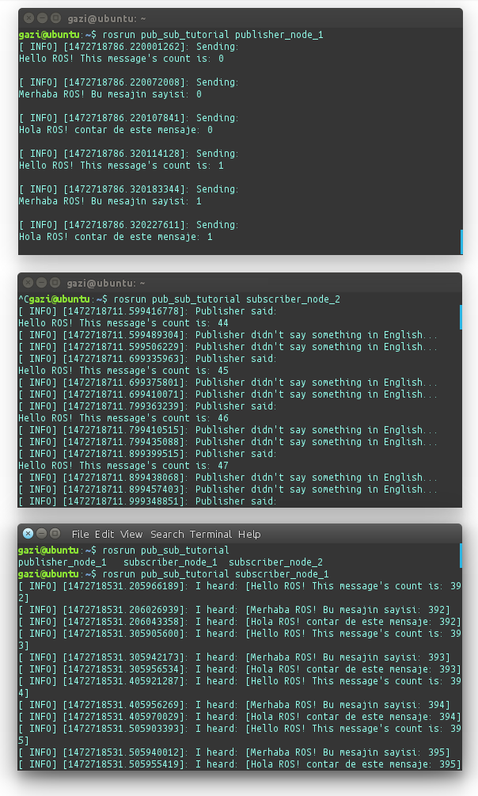

5. Simple Communication
=======================

As a We said before, 'Node' is the ROS term for an executable that is connected to the ROS network. In this tutorial, We'll create a publisher node which will continually broadcast some messages. And Two subscribers; one of them reads the topic and writes every message which it received, and the other, reads all of them but prints only Hello messages.

Our goal is writing the nodes like in the diagram below:

.. figure:: _static/ros_network_local.svg
   :align: center

1. Creating the Package
-----------------------

If you will encounter problems on creating package, you can clone from `github <https://github.com/milvusrobotics/ros_tutorials/tree/master/pub_sub_tutorial>`_. But we suggest creating package by hand for good experiment.

In a previous tutorials, We've created our workspace. First, we need to locate our nodes in some package. Go to the your workspace's src folder before creating new package:

::
	
	$ cd ~/catkin_ws/src/

Then create your package:

::
	
	$ catkin_create_pkg pub_sub_tutorial std_msgs rospy roscpp

``pub_sub_tutorial`` is the name of our package and following parts are dependencies. This command will create the folder and some information automatically by the information which you gave to ``catkin_create_pkg``. 

2. Create the files
-------------------

Then, go to the project's own ``src`` folder and create the files we need:

::
	
	$ cd ~/catkin_ws/src/pub_sub_tutorial/src/

::
	
	$ touch pub1.cpp && touch sub1.cpp && touch sub2.cpp

**2.1. Writing the publisher**

In this tutorial, We have only one publisher. Paste the following codes inside of ``pub1.cpp`` which in ``~/catkin_ws/src/pub_sub_tutorial/src`` folder:

.. code-block:: c
	
	#include "ros/ros.h"
	#include "std_msgs/String.h"
	
	#include <sstream>
	
	int main ( int argc, char **argv )
	{
		ros::init ( argc, argv, "publisher_node_1" );
		ros::NodeHandle n;
		ros::Publisher chatter_pub = n.advertise<std_msgs::String> ( "chatter", 1000 );
		ros::Rate loop_rate ( 10 );
		
		int count = 0;
		
		std_msgs::String msg;
		std::stringstream ss;
		
		while ( ros::ok() )
		{	
			ss.str(std::string());
			ss << "Hello ROS! This message's count is: " << count;
			msg.data = ss.str();
			ROS_INFO ( "Sending:\n%s\n", msg.data.c_str() );
			chatter_pub.publish ( msg );
			
			ss.str(std::string());
			ss << "Merhaba ROS! Bu mesajin sayisi: " << count;
			msg.data = ss.str();
			ROS_INFO ( "Sending:\n%s\n", msg.data.c_str() );
			chatter_pub.publish ( msg );
			
			ss.str(std::string());
			ss << "Hola ROS! contar de este mensaje: " << count;
			msg.data = ss.str();
			ROS_INFO ( "Sending:\n%s\n", msg.data.c_str() );
			chatter_pub.publish ( msg );
			
			ros::spinOnce();
			loop_rate.sleep();
			count++;
		}
		
	return 0;
	}

**Explanation**

You must call one of the versions of ``ros::init()`` before using any other part of the ROS system:

.. code-block:: c
	
	ros::init ( argc, argv, "publisher_node_1" );

The ``ros::init()`` function needs to see ``argc`` and ``argv`` so that it can perform any ROS arguments and name remapping that were provided at the command line. For programmatic remappings you can use a different version of ``init()`` which takes remappings directly, but for most command-line programs, passing argc and argv is the easiest way to do it.  The third argument to ``init()`` is the name of the node.

.. code-block:: c
	
	ros::NodeHandle n;

And, NodeHandle is the main access point to communications with the ROS system. The first NodeHandle constructed will fully initialize this node, and the last NodeHandle destructed will close down the node.

.. code-block:: c
	
	ros::Publisher chatter_pub = n.advertise<std_msgs::String> ( "chatter", 1000 );
	...
	chatter_pub.publish ( msg );

The ``publish()`` function is how you send messages. The parameter is the message object. The type of this object must agree with the type given as a template parameter to the ``advertise<>()`` call, as was done in the constructor above.

**2.2. Writing the subscribers**

Paste the following codes to ``sub1.cpp``:

.. code-block:: c
	
	#include "ros/ros.h"
	#include "std_msgs/String.h"

	void chatterCallback ( const std_msgs::String::ConstPtr &msg )
	{
		ROS_INFO ( "I heard: [%s]", msg->data.c_str() );
	}

	int main ( int argc, char **argv )
	{
		ros::init ( argc, argv, "subscriber_node_1" );
		ros::NodeHandle n;
		ros::Subscriber sub = n.subscribe ( "chatter", 1000, chatterCallback );
		ros::spin();
		
	return 0;
	}

**Explanation**

.. code-block:: c
	
	void chatterCallback ( const std_msgs::String::ConstPtr &msg )
	{
		ROS_INFO ( "I heard: [%s]", msg->data.c_str() );
	}	

The ``subscribe()`` call is how you tell ROS that you want to receive messages on a given topic. This invokes a call to the ROS master node, which keeps a registry of who is publishing and who is subscribing.  Messages are passed to a callback function, here called chatterCallback.  ``subscribe()`` returns a Subscriber object that you must hold on to until you want to unsubscribe.  When all copies of the Subscriber object go out of scope, this callback will automatically be unsubscribed from this topic:

.. code-block:: c
	
	ros::Subscriber sub = n.subscribe ( "chatter", 1000, chatterCallback );

The second parameter to the ``subscribe()`` function is the size of the message queue. If messages are arriving faster than they are being processed, this is the number of messages that will be buffered up before beginning to throw away the oldest ones.

``ros::spin()`` will enter a loop, pumping callbacks.  With this version, all callbacks will be called from within this thread (the main one).  ``ros::spin()`` will exit when ``Ctrl-C`` is pressed, or the node is shutdown by the master.

Finally, paste the following to ``sub2.cpp``:

.. code-block:: c
	
	#include "ros/ros.h"
	#include "std_msgs/String.h"

	void chatterCallback ( const std_msgs::String::ConstPtr &msg )
	{
		if (msg->data.substr(0, 5) == "Hello")
		{
			ROS_INFO ( "Publisher said:\n%s", msg->data.c_str() );
		}
		else 
		{
			ROS_INFO ( "Publisher didn't say something in English...");
		}
	}

	int main ( int argc, char **argv )
	{
		ros::init ( argc, argv, "subscriber_node_2" );
		ros::NodeHandle n;
		ros::Subscriber sub = n.subscribe ( "chatter", 1000, chatterCallback );
		ros::spin();
		
	return 0;
	}

In here additionaly, We're looking to first characters of string. If it is Hello, Subscriber understands that message is in English:

.. code-block:: c
	
	if (msg->data.substr(0, 5) == "Hello")

3. Building your nodes
----------------------

The automatically generated ``CMakeLists.txt`` file is in your project folder. Open it, then simply add these few lines to the bottom of your ``CMakeLists.txt``, don't worry about the commented (``#``) example lines:

.. code-block:: guess
	
	include_directories(include ${catkin_INCLUDE_DIRS})

	add_executable(publisher_node_1 src/pub1.cpp)
	target_link_libraries(publisher_node_1 ${catkin_LIBRARIES})
	add_dependencies(publisher_node_1 pub_sub_tutorial_generate_messages_cpp)

	add_executable(subscriber_node_1 src/sub1.cpp)
	target_link_libraries(subscriber_node_1 ${catkin_LIBRARIES})
	add_dependencies(subscriber_node_1 pub_sub_tutorial_generate_messages_cpp)

	add_executable(subscriber_node_2 src/sub2.cpp)
	target_link_libraries(subscriber_node_2 ${catkin_LIBRARIES})
	add_dependencies(subscriber_node_2 pub_sub_tutorial_generate_messages_cpp)

	
For more detailed discription of the ``CMakeLists.txt`` file, see it on `ROS Wiki <http://wiki.ros.org/catkin/CMakeLists.txt>`_

Then navigate to your workspace's top and build your projects:

::
	
	$ cd ~/catkin_ws

::
	
	$ catkin_make

And please do not forgot to source your new executables before running them in already opened terminals:

::
	
	$ source devel/setup.bash

After building via ``catkin_make``, you should source the new files for that terminal. If you added source command at the end of the ``.bashrc`` file, Opening up a new terminal calls this automatically.

4. Test Your Nodes
------------------

In a previous tutorials, ``roscore`` is started automatically via launching ``mrp2_gazebo.launch`` file. But now you must to open it first in another terminal:

::
	
	$ roscore

After entering above command, open up another terminal to start our publisher:

::
	
	$ rosrun pub_sub_tutorial publisher_node_1

Then, open up another for running first subscriber:

::
	
	$ rosrun pub_sub_tutorial subscriber_node_1

Then the other in another:

::
	
	$ rosrun pub_sub_tutorial subscriber_node_2

The output will something similiar to this:

