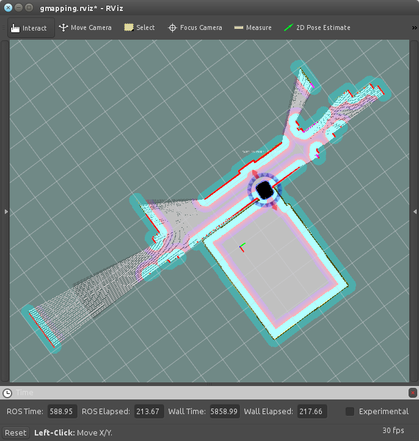

1. Simülasyondaki Dünyayı Keşfedin
==================================

Bu kılavuzda simülasyondaki çevreyi robotun gözünden görüp haritaya kaydedeceğiz.

1. Gazebo Simülasyon Programını Çalıştırma
------------------------------------------

.. note::
	
	``ROS_MASTER_IP`` ve ``ROS_HOSTNAME`` parametrelerinin boş veya localhost'a göre ayarlı olduğuna emin olun. Bunun için bu parametreleri ilk kılavuzda österildiği gibi kontrol edebilirsiniz.

Eğer zaten çalışan bir Gazebo Simülatör penceresi varsa, direk ikinci adıma geçebilirsiniz. Ama sonradan oluşturacağımız haritada konumlanmada kolaylık için, robotun başlangıç pozisyonunda olduğuna emin olun. Değilse, ``Ctrl+C`` ile nodu kapatıp aşağıdaki komutla yeniden başlatın;

::

    $ roslaunch mrp2_gazebo mrp2_gazebo.launch

Ya da kapalıysa direk aynı komutla açabilirisiniz;

::

    $ roslaunch mrp2_gazebo mrp2_gazebo.launch

2. Gmapping Uygulamasını Başlatma
---------------------------------

Şimdi, Eş Zamanlı Konumlama ve Haritalama uygulamasını (Simultaneous Localization and Mapping, SLAM) açabiliriz. Başka bir terminal penceresi açın ve aşağıdakini yazın(*Bir terminal sekmesi açmanızı öneririz*):

::

    $ roslaunch mrp2_navigation gmapping_demo.launch

Gmapping uygulaması başladı ve robot harita çıkararak kendisini harita üzerinde konumlandırmaya başladı. Artık, bir önceki kılavuzlarda gösterildiği gibi joystick ile veya istediğiniz bir başka yöntemle robotu kontrol edebilirsiniz.

3. RViz ile Gmapping'i Görselleştirin
-------------------------------------

Gmapping çalışıyor ama robotun içnde nelerin döndüğünü bizim de görmemiz gerek. Diğer bir terminali açın ve şunu yazın;

::

    $ roslaunch mrp2_viz view_gmapping.launch

Sonunda simülasyondaki dünyayı robotun bildiği kadarıyla bir kısmını 2B olarak görebiliyoruz. RViz'de robotu interactive marker'lar ile kontrol edebilir, robota, gitmesi için basit hedefler yollayabilirisiniz. 

	

Eğer keşfiniz tamamlandıysa, istediğiniz zaman haritayı kaydedebilirsiniz, bir diğer terminal açın ve ``<..>`` kısmını istediğiniz dosya yolu ile değiştirip aşağıdaki komutu girin;

::

    $ rosrun map_server map_saver -f <DOSYANIN ADRESİ, ÖRN:/home/gazi/>new_map_1

Bu komut: ``new_map_1.pgm`` ve ``new_map_1.yaml`` adında iki dosya oluşturur. Bu dosyaları daha sonra ``amcl`` uygulamasıyla kullanabiliriz. Nasıl olduğunu öğrenmek için bir sonraki kılavuza bakabilirisiniz.
