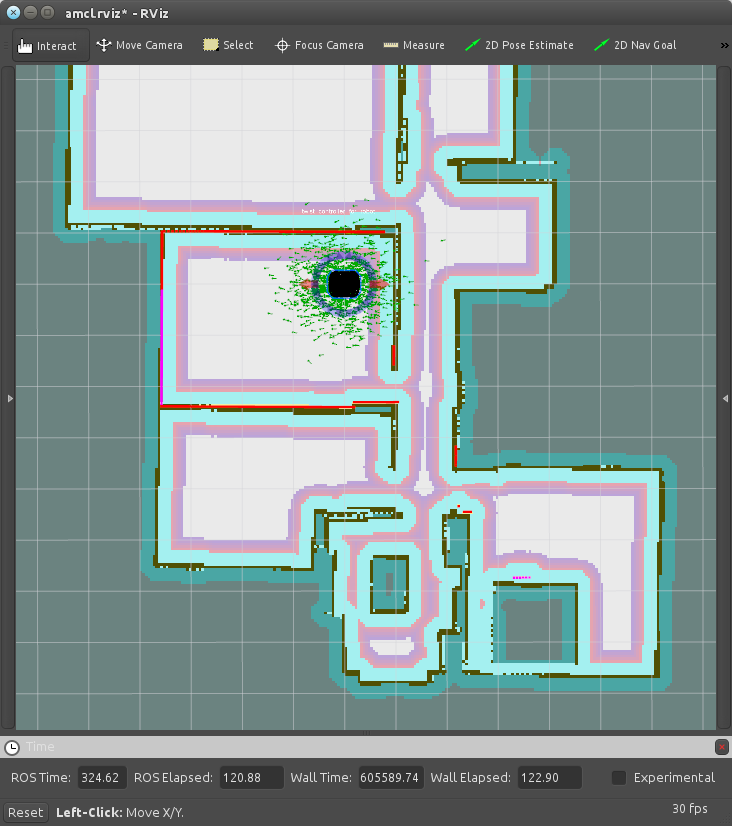

2. Bilinen bir Harita ile Navigasyon
====================================

Daha önceden kaydedilmiş bir harita ile gezinin!
	
1. Gazebo Simülatör Programını Açın
-----------------------------------

.. note::
	
	``ROS_MASTER_IP`` ve ``ROS_HOSTNAME`` değişkenlerinin boş veya localhost'a ayarlı olduklarına emin olun. Bunun için yeni bir terminal açıp şunları deneye bilirsiniz:

	::

		$ echo $ROS_MASTER_URI

	ve

	::

		$ echo ROS_HOSTNAME

	Temizlemek içinse şunu yazmanız yeterlidir: 

	::

		$ export ROS_MASTER_IP= $$ export ROS_HOSTNAME=

Eğer zaten çalışan bir Gazebo Simülatör penceresi varsa, direk ikinci adıma geçebilirsiniz. Ama sonradan oluşturacağımız haritada konumlanmada kolaylık için, robotun başlangıç pozisyonunda olduğuna emin olun. Değilse, ``Ctrl+C`` ile nodu kapatıp aşağıdaki komutla yeniden başlatın;

::

    $ roslaunch mrp2_gazebo mrp2_gazebo.launch

Ya da kapalıysa direk aynı komutla açabilirisiniz;

::

    $ roslaunch mrp2_gazebo mrp2_gazebo.launch

2. AMCL İşlemini Başlatma
-------------------------

Şimdi, bir ``amcl`` (Adaptive Monte Carlo Localization, *Uyumlu Monte Carlo Konumlama Sistemi*) işlemi başlatabiliriz. Başka bir terminal açın ve şunu yazın:

::

    $ roslaunch mrp2_navigation amcl_demo.launch

Bu komut ``amcl`` uygulamasını daha önceden kaydedilmiş ``milvus_office.yaml`` harita dosyası ile açar. Eğer şöyle bir dizinde dosyanız varsa; ``/tmp/new_map.yaml``, ve o haritayla başlatmak isterseniz:

::

    $ roslaunch mrp2_navigation amcl_demo map_file:=/tmp/my_map.yaml

komutunu girmeniz yeterlidir. 

.. note ::
	
	``map_file`` argümanı, dosyanızın tam yolunu alır. Örnek vermek gerekirse, ``~`` karakterini de kullanamazsınız. 

Şimdi, yine robotu daha önceki kılvauzlarda gösterilen herhangi bir yöntemle sürebilirisiniz.

3. AMCL'i RViz ile Görselleştirme
---------------------------------

Şimdi robotun bir haritası var ve nereye gittiğini bilmekte. Eğer siz de robotun nereye gittiğini düşündüğünü görmek isterseniz aşağıdaki komutu bir başka terminale girebilirisiniz;

::

    $ roslaunch mrp2_viz view_amcl.launch

Açılan pencerede haritayı ve Robotun bulunabileceğini düşündüğü pozisyon ve yönleri simgeleyen okları göreceksiniz, Ve robot da hesapladığı en iyi ihtimalli okun üzerinde durur. Önceden de belirttiğimiz gibi Rviz üzerinden interactive marker'larla robotu hareket ettirebilir veya basit hedefler yollayabilirisiniz. Robot hareket ettikçe olası ihtimallerin değiştiğini görebilirisiniz.

