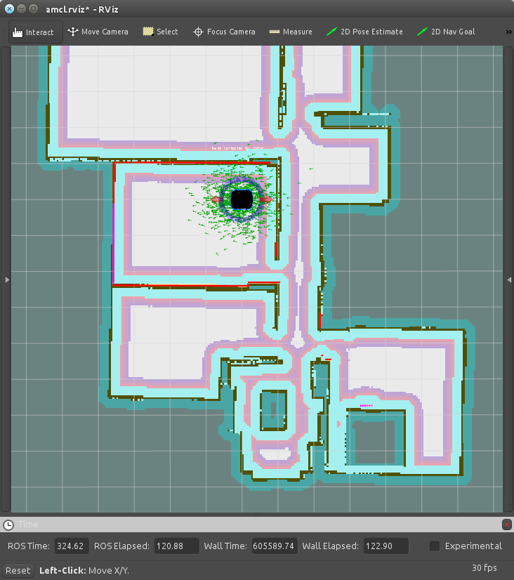

2. Navigate with a known map
============================

Ramble in the known area with a previously saved a map
	
1. Start Gazebo Process
-----------------------

Note that, be sure the ``ROS_MASTER_IP`` and ``ROS_HOSTNAME`` variables are empty. For that, you can check this variables after opening up new terminal by:

::

    $ echo $ROS_MASTER_URI

and

::

    $ echo ROS_HOSTNAME

For clearing, just type: 

::

    $ export ROS_MASTER_IP= $$ export ROS_HOSTNAME=

If there are already running Gazebo process exists you can pass to second seciton directly but be sure the robot is standing in its first location. If it is not, restart by killing and opening it back via;

::

    $ roslaunch mrp2_gazebo mrp2_gazebo.launching

command, Or normally start in same way;

::

    $ roslaunch mrp2_gazebo mrp2_gazebo.launching

2. Start AMCL - Adaptive Monte Carlo Localization Demo
------------------------------------------------------

Now you able to open amcl demo, just open another terminal window (*We suggest it as a new terminal tab*):

::

    $ roslaunch mrp2_navigation amcl_demo.launch

That command starts the ``amcl`` application with a previously saved ``milvus_office.yaml`` map file. If you have map file with ``/tmp/new_map.yaml`` path, and want to start with your map file, just enter:

::

    $ roslaunch mrp2_navigation amcl_demo map_file:=/tmp/my_map.yaml

Note that ``map_file`` argument takes full path of your file. You can't use variables or ``~`` character on it. You can start moving robot via joystick or what you prefer to control, as a described in first tutorial.

3. Visualise AMCL via RViz
--------------------------

The robot has a map and knows what it is doing by itself. If you need to know too, Open up other terminal and type;

::

    $ roslaunch mrp2_viz view_amcl.launch

Now, we can see a map and represantation of robot's posible locations, and the robot stands on most probable one. You can control the robot via interactive markers, send a simple goal from RViz. When the robot moves, You can see probable locations and most probable one are changes.

