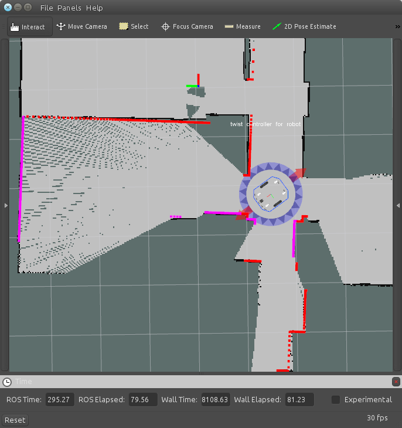

4. Make a Real Map with Your Real Robot
=======================================

Explore the real environment from robot's vision and save a map of it.
	
1. Open up robot
----------------

**1.1 Power up robot**

If the robot is already running, you can pass to second section directly. Otherwise you can turn back to previous tutorial and access control of it.

2. Start Gmapping Process
-------------------------

Now you can open SLAM application. Run this command on your remote PC's terminal;

::
	
	$ roslaunch mrp2_navigation gmapping_demo.launch

Now, gmapping process is started and the robot is started to create a map and locating itself on it. You can start moving robot via joystick or what you prefer to control as a described in previous tutorial. For example If you want to control it via ``rqt_robot_steering``, open up new terminal tab and run ``rqt_robot_steering``:

::
	
	$ rosrun rqt_robot_steering rqt_robot_steering

3. Visualise Gmapping Process via RViz
--------------------------------------

Gmapping process is running but We need to know actually what is going on. Open up other
terminal tab on your remote PC and type;

::
	
	$ roslaunch mrp2_viz view_gmapping.launch

Finally, can see a part of our world's 2D map from robot's knowledge. View is similiar to simulation as we see. You can control the robot via interactive markers, send a simple goal from RViz. 

If your exploring will done, You can save the map whenever you want, for doing that; open up new terminal tab and connect via SSH first:

::
	
	$ ssh mrp2@<IP_OF_ROBOT>

And save the map, if you want to name it that ``my_new_map``, run;

::
	
	$ rosrun map_server map_saver -f /home/mrp2/my_new_map

This command generates two files: ``new_map.pgm`` and ``new_map.yaml``. 

One can use these files with ``amcl`` application later. You can follow the previous amcl tutorial, It is similiar with simulation. Just, don't forget; the ``map_server`` saves the map on robot's computer.
